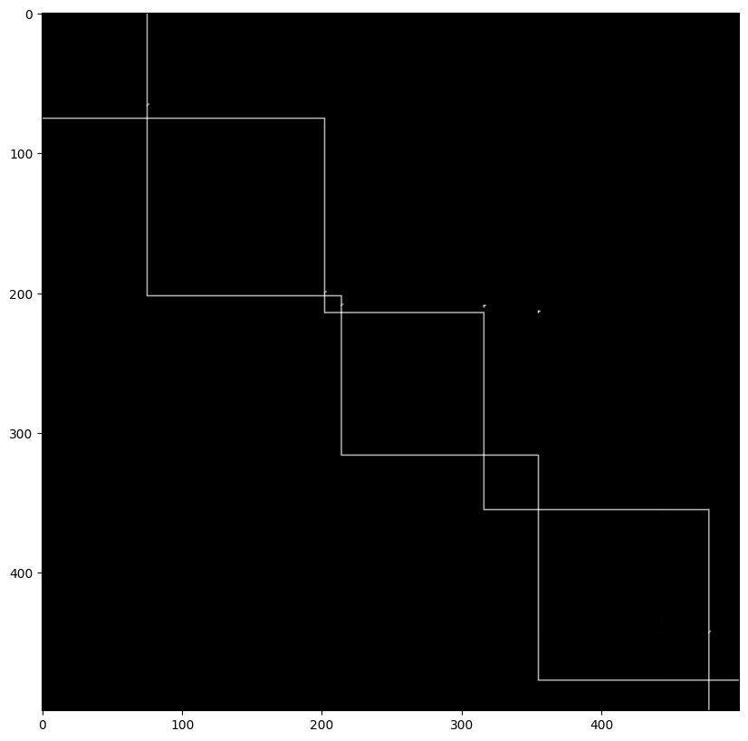

# IVAT image processing techniques and algorithms

## 1. Finding Intersecting Points using Fixed Threshold for Estimated Binarization

```python
train = np.load("traindata5.npy",allow_pickle=True)
target = np.load("onehotlabelsdata5.npy",allow_pickle=True)
```

```python
plt.imshow(train[0], cmap='gray')
```

<figure><figcaption></figcaption></figure>

```python
from sklearn.model_selection import train_test_split
```

```python
x_train, x_test, y_train, y_test = train_test_split(train, target, test_size=0.01, shuffle=False)
```

Preserving the original data for comparison

```python
x_train_original = x_train
x_test_original = x_test
```

Testing the Binarization Thresholding and First Derivative on an IVAT Image

```python
thresh = image
uplim = 5
thresh[thresh > uplim] = 255
```

```python
plt.imshow(thresh, cmap='gray')
```

<figure><figcaption></figcaption></figure>


```python
di = thresh[:-1,1:] - thresh[1:,1:]
dj = thresh[1:,:-1] - thresh[1:,1:]
mag = np.sqrt(di**2 + dj**2)
```

```python
plt.figure(figsize=(10,10))
plt.imshow(mag, cmap='gray')
```

<figure><figcaption></figcaption></figure>

### Compiling this into a function

```python
import cv2
```

```python
def Derivative(image):
    # Thresholding
    thresh = image
    thresh = np.where(thresh > 4, 255, 0)
    # First Derivative
    x, y = image.shape[0], image.shape[1]
    di = thresh[:-1,1:] - thresh[1:,1:]
    dj = thresh[1:,:-1] - thresh[1:,1:]
    mag = np.sqrt(di**2 + dj**2)
    mag = cv2.resize(mag, (x, y))
    mag = np.where(mag > 5, 255, 0)
    # Return
    return mag
```

```python
from tqdm.auto import tqdm
```

```python
for i in tqdm(range(len(x_train))):
    x_train[i] = Derivative(x_train[i])
```

```python
annot = []
batch = []
for train_image in tqdm(x_train):
    for i in range(len(train_image)):
        for j in range(len(train_image)):
            if i == j and train_image[i][j] == 255:
                batch.append(1)
            if i == j and train_image[i][j] == 0:
                batch.append(0)
    annot.append(batch)
    batch = []
```

All the diagonal points in the generated Derivative image which are 1 are basically points of intersection indicating a boundary there

There accuracy metrics are done taking a one vs all case for binary classification on a one hot encoded variable

```python
accuracy = 0
iters = 0

for predicted, actual in tqdm(zip(annot, y_train)):
    for i in range(len(actual)):
        if actual[i] == predicted[i]:
            accuracy += 1
            iters += 1
        else:
            accuracy += 0
            iters += 1
```

```python
"Accuracy for the differential thresholding non ML algorithm is : " + str (accuracy / iters)
```

Matching scores for both 1 and 0 values: 0.9889

#### Accuracy of only when 1 is correctly predicted (pragmatic case)

```python
accuracy = 0
iters = 0

for predicted, actual in tqdm(zip(annot, y_train)):
    for i in range(len(actual)):
        if predicted[i] == 1:
            buffer = 10
            if i - buffer < 0:
                focus = actual[0: i+10]
            if i + buffer < 499:
                focus = actual[i-buffer: -1]
            else:
                focus = actual[i-buffer: i+buffer]
            if 1 in focus:
                accuracy += 1
            iters += 1
```

Added a buffer for the classification to handle cases where the classification may be a few steps forward or behind, useful in cases with high level of sub clustering

```python
"Accuracy for the buffering bbox non ML algorithm coordinate finder is : " + str (accuracy / iters)
```

0.9844

<figure><figcaption></figcaption></figure>

<figure><figcaption></figcaption></figure>

Considerations

* Complex Clusters can not benefit from this as subclusters have varying shades and hence binarization is not a good approach there.
* Works only if the nature of the IVAT nature is known before clustering and using the derivative function on it.

## 2. Adaptive Threshold for multiple discretized levels of image intensity for intersection detection

We use OpenCV's Adaptive Threshold Function to obtain multistep thresholding levels which goes well with derivatives to obtain edges particularly well provided optimal parameters are considered

```python
import time
from IPython.display import clear_output
```

```python
image = train[114]
gray_im = np.array(image, dtype=np.uint8)
adapt_im = cv2.adaptiveThreshold(gray_im,255,cv2.ADAPTIVE_THRESH_MEAN_C, cv2.THRESH_BINARY,155,1)
plt.figure(figsize=(10,10))
plt.subplot(1,2,1)
plt.imshow(image, cmap='gray')
di = adapt_im[:-1,1:] - adapt_im[1:,1:]
dj = adapt_im[1:,:-1] - adapt_im[1:,1:]
mag = np.sqrt(di**2 + dj**2)
plt.subplot(1,2,2)
plt.imshow(mag, cmap='gray')

```

<figure><figcaption><p>Sample of the derivative function, it is im</p></figcaption></figure>

## Function compilation of the method

```python
def Derivative(image):
    # Thresholding
    gray_im = np.array(image, dtype=np.uint8)
    adapt_im = cv2.adaptiveThreshold(gray_im,255,cv2.ADAPTIVE_THRESH_MEAN_C, cv2.THRESH_BINARY,175,1)
    di = adapt_im[:-1,1:] - adapt_im[1:,1:]
    dj = adapt_im[1:,:-1] - adapt_im[1:,1:]
    mag = np.sqrt(di**2 + dj**2)
    mag = mag.astype(np.uint8)
    mag = cv2.resize(mag, (500, 500))
    mag = np.where(mag > 0, 1, 0)
    # Return
    return mag
```

```python
for i in tqdm(range(len(train))):
    traindydx.append(Derivative(train[i]))
```

```python
traindydx = np.array(traindydx)
```

Checking accuracy from the methods shown above

```python
annot = []
batch = []
for train_image in tqdm(traindydx):
    for i in range(len(train_image)):
        for j in range(len(train_image)):
            if i == j and train_image[i][j] == 1:
                batch.append(1)
            if i == j and train_image[i][j] == 0:
                batch.append(0)
    annot.append(batch)
    batch = []
```

```python
accuracy = 0
iters = 0

for predicted, actual in tqdm(zip(annot, target)):
    for i in range(len(actual)):
        if actual[i] == predicted[i]:
            accuracy += 1
            iters += 1
        else:
            accuracy += 0
            iters += 1
```

```python
"Accuracy for the differential thresholding non ML algorithm is : " + str (accuracy / iters)
```

0.98044

```python
accuracy = 0
iters = 0

for predicted, actual in tqdm(zip(annot, target)):
    for i in range(500):
        if predicted[i] == 1:
            buffer = 20
            if i - buffer < 0:
                focus = actual[0: i+buffer]
            elif i + buffer < 499:
                focus = actual[i-buffer: -1]
            else:
                focus = actual[i-buffer: i+buffer]
            if 1 in focus:
                accuracy += 1
            iters += 1
```

```python
"Accuracy for the buffering bbox non ML algorithm coordinate finder is : " + str (accuracy / iters)
```

0.52778 (Not sure why is it low, needs further exploration)
